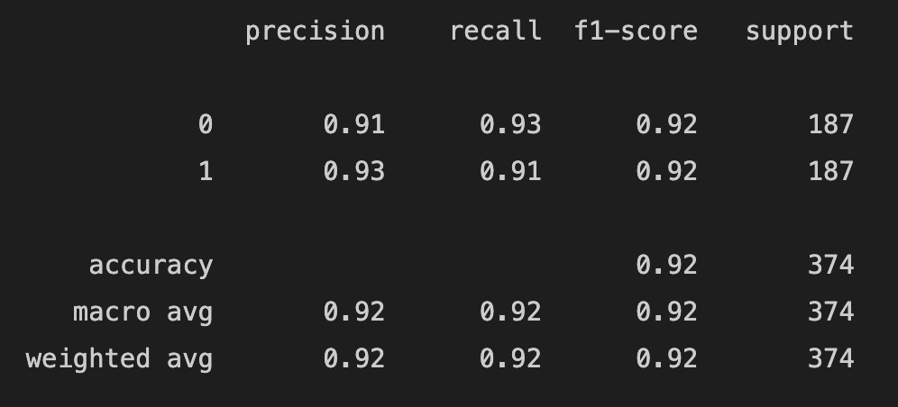

# Spam email detection using BERT
In this repo I present a classifier system that detects spam email, using [BERT](https://arxiv.org/abs/1810.04805) and deep neural network.

## Pipeline:
1. EDA
2. Data preprocessing
3. Model building
- BERT preprocessor: process input text into the format which encoder accepts
- BERT encoder: feed processed text to the BERT model which then generates a contextualized word embedding for training data
- Fit the final training data into a Random Forest classifer (benchmark) and deep NN
- Add dropout layer to avoid overfitting
- Add a softmax layer to predict the outcome in 2 categories
4. Parameter tuning
5. Model evaluation

## Result:

- A simple random forest with no hyper-parameter tunning but using BERT for encoding text input has a precision of 86% on the 
spam email while retrieving 76% of all spam observations. Pretty good!

- Our deep neural network with BERT achieved a precision of 93% on spam emails and a recall of 91%, which means that 91% actual spams were identified correctly (see below)

